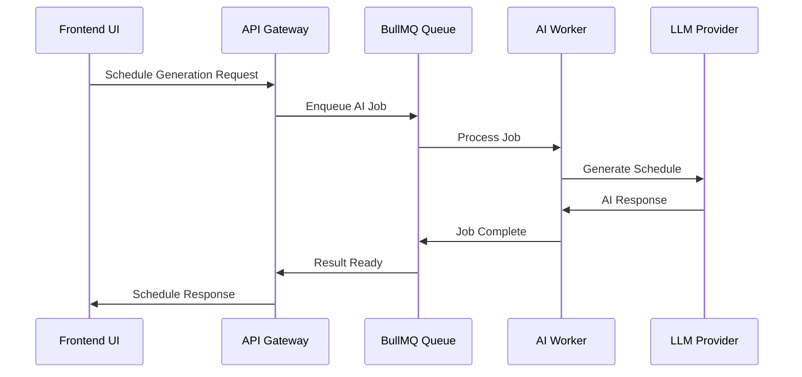

# 🤖 AI Agent Architecture & Scalability Strategy

## 🏗️ System Architecture

### High-Level Overview

```
┌─────────────────┐    ┌─────────────────┐    ┌─────────────────┐
│   Frontend UI   │    │   API Gateway   │    │  AI Dispatcher  │
│  (React + TS)   │◄──►│  (Express.js)   │◄──►│   (Node.js)     │
└─────────────────┘    └─────────────────┘    └─────────────────┘
                                                        │
                                                        ▼
┌─────────────────┐    ┌─────────────────┐    ┌─────────────────┐
│     Redis       │    │   BullMQ Queue  │    │  AI Worker Pool │
│   (Cache/Jobs)  │◄──►│   (Job Mgmt)    │◄──►│ (LLM Processing)│
└─────────────────┘    └─────────────────┘    └─────────────────┘
                                                        │
                                                        ▼
┌─────────────────┐    ┌─────────────────┐    ┌─────────────────┐
│   PostgreSQL    │    │  Result Store   │    │   LLM Provider  │
│ (Persistent DB) │◄──►│ (Cache/Results) │◄──►│ (OpenAI/Local)  │
└─────────────────┘    └─────────────────┘    └─────────────────┘
```

## 🔄 AI Processing Workflow

### 1. Request Flow



### 2. Data Flow Architecture

#### **Input Processing**

- **Task Definition**: Title, description, duration estimates
- **Constraints**: Dependencies, resources, deadlines
- **Context**: Historical data, user preferences
- **Validation**: Schema validation, business rules

#### **AI Processing**

- **Prompt Engineering**: Dynamic template generation
- **Model Selection**: Choose appropriate LLM based on complexity
- **Response Processing**: Parse and validate AI output
- **Quality Assurance**: Consistency checks and validation

#### **Output Delivery**

- **Result Formatting**: Structure for frontend consumption
- **Caching Strategy**: Store frequently requested schedules
- **Error Handling**: Graceful degradation and fallbacks
- **Feedback Collection**: User corrections and improvements

## 🚀 Scalability Strategy

### Horizontal Scaling Components

#### **1. AI Worker Pool**

```javascript
// Worker scaling configuration
const workerConfig = {
  minWorkers: 2,
  maxWorkers: 10,
  scaleUpThreshold: 80, // Queue utilization %
  scaleDownThreshold: 20, // Queue utilization %
  workerIdleTimeout: 300000, // 5 minutes
};
```

#### **2. Load Balancing**

- **Round-robin** worker assignment
- **Health check** based routing
- **Geographic distribution** for global deployment
- **Failover mechanisms** for high availability

#### **3. Caching Strategy**

```javascript
// Multi-layer caching
const cachingLayers = {
  L1: "In-memory (Worker)", // Fast access, small size
  L2: "Redis (Shared)", // Medium speed, shared across workers
  L3: "PostgreSQL", // Persistent, full history
};
```

### Performance Optimization

#### **1. Prompt Optimization**

- **Template caching** for common patterns
- **Prompt compression** to reduce token usage
- **Context window management** for long conversations
- **Response streaming** for real-time updates

#### **2. Model Efficiency**

- **Model switching** based on request complexity
- **Batch processing** for similar requests
- **Request deduplication** to avoid redundant processing
- **Response compression** for network optimization

#### **3. Resource Management**

- **Memory pooling** for worker processes
- **Connection pooling** for database access
- **CPU throttling** to prevent resource exhaustion
- **Garbage collection** optimization

## 🛡️ Reliability & Monitoring

### Error Handling Strategy

#### **1. Retry Mechanisms**

```javascript
const retryConfig = {
  maxRetries: 3,
  backoffStrategy: "exponential",
  baseDelay: 1000,
  maxDelay: 30000,
  retryableErrors: ["RATE_LIMIT", "TIMEOUT", "NETWORK_ERROR"],
};
```

#### **2. Circuit Breaker Pattern**

- **Failure threshold**: 5 consecutive failures
- **Recovery timeout**: 60 seconds
- **Half-open testing**: Gradual traffic restoration
- **Fallback responses**: Cached or simplified results

#### **3. Health Monitoring**

```javascript
const healthChecks = {
  apiGateway: "/health",
  aiWorkers: "/worker/health",
  redis: "PING command",
  postgres: "SELECT 1",
  llmProvider: "Simple test prompt",
};
```

### Monitoring Metrics

#### **Key Performance Indicators**

- **Response Time**: P50, P95, P99 latencies
- **Throughput**: Requests per second, jobs per minute
- **Error Rate**: Failed requests percentage
- **Queue Depth**: Pending job count
- **Worker Utilization**: CPU, memory, active workers

#### **Business Metrics**

- **Schedule Quality**: User acceptance rate
- **Cost Efficiency**: Token usage per request
- **User Satisfaction**: Feedback scores
- **Feature Adoption**: AI feature usage rates

## 🔧 Implementation Guidelines

### Development Phases

#### **Phase 1: Foundation (Current)**

- [x] Basic Express.js API structure
- [x] React frontend with TypeScript
- [x] Database schema design
- [ ] Redis integration
- [ ] Basic AI worker implementation

#### **Phase 2: AI Integration**

- [ ] OpenAI API integration
- [ ] Prompt engineering framework
- [ ] Basic scheduling generation
- [ ] Result caching implementation
- [ ] Error handling and retries

#### **Phase 3: Scaling**

- [ ] Worker pool management
- [ ] Load balancing implementation
- [ ] Advanced caching strategies
- [ ] Performance monitoring
- [ ] Horizontal scaling preparation

#### **Phase 4: Production**

- [ ] Kubernetes deployment
- [ ] Production monitoring
- [ ] Security hardening
- [ ] Performance optimization
- [ ] Documentation completion

### Technology Decisions

#### **Why BullMQ?**

- **Redis-based**: Leverages existing Redis infrastructure
- **TypeScript support**: Native TypeScript integration
- **Rich features**: Delayed jobs, priorities, retries
- **Observability**: Built-in monitoring and metrics
- **Scalability**: Horizontal scaling support

#### **Why OpenAI API?**

- **Quality**: State-of-the-art language understanding
- **Reliability**: Enterprise-grade infrastructure
- **Documentation**: Comprehensive API documentation
- **Community**: Large developer ecosystem
- **Flexibility**: Multiple model options

#### **Alternative Considerations**

- **Local LLMs**: Llama, Mistral for cost optimization
- **Hybrid approach**: Local for simple, API for complex
- **Multi-provider**: Fallback between different LLM providers

## 📈 Future Roadmap

### Short-term (1-3 months)

- Complete basic AI worker implementation
- Implement prompt engineering framework
- Add basic monitoring and logging
- Deploy to staging environment

### Medium-term (3-6 months)

- Add advanced scheduling algorithms
- Implement feedback loop for model improvement
- Add multi-model support
- Production deployment

### Long-term (6+ months)

- Custom model fine-tuning
- Advanced optimization algorithms
- Real-time collaboration features
- Mobile application support

---

**Next Steps**: Implement the AI worker pool and BullMQ integration as outlined in the implementation checklist.
