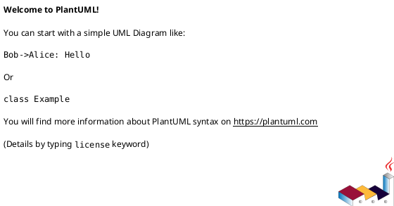

# 📊 PlantUML Quick Reference - AI Scheduler

## 🚀 Getting Started

### **View Architecture Diagram**

1. Open `docs/diagrams/architecture.puml`
2. Press `Ctrl+Shift+P` → "PlantUML: Preview Current Diagram"
3. Or right-click the `.puml` file → "Preview"

### **Export Diagrams**

1. With diagram open, press `Ctrl+Shift+P`
2. Choose "PlantUML: Export Current Diagram"
3. Select format: PNG, SVG, PDF, etc.

## 🎨 Diagram Files in Project

| Diagram                            | Purpose                     | Location         |
| ---------------------------------- | --------------------------- | ---------------- |
| **architecture.puml**              | Complete system overview    | `docs/diagrams/` |
| **orchestrator-architecture.puml** | Workflow orchestrator focus | `docs/diagrams/` |
| **ai_agent_service_diagram.puml**  | AI worker flow              | `docs/ai/`       |

## ⚙️ VS Code Configuration

Your workspace is already configured with:

- ✅ PlantUML extension installed
- ✅ Auto-preview enabled
- ✅ SVG export format
- ✅ Online server rendering

## 🧩 Key Components in Architecture

### **Central Hub: Workflow Orchestrator**

- Coordinates all modules and systems
- Handles event-driven processing
- Manages approval workflows

### **Core Scheduling System**

- **Schedule Engine** (gold) - Main computation
- **Constraint Manager** - Rules and limitations
- **Delay Analyser** (red) - Risk assessment
- **Change Manager** (pink) - Audit trail

### **AI & Analytics**

- **Gen AI** (green) - Planning assistant
- **AI Prediction Model** (blue) - Real-time analysis
- **Quality Checker** (orange) - DCMA compliance
- **AI Trainer** (light blue) - Learning system

### **External Integrations**

- ERP/HRMS systems
- Primavera/MS Project
- BIM/4D visualization
- Progress tracking

## 🔄 Updating Diagrams

### **Edit Architecture**

1. Modify `docs/diagrams/architecture.puml`
2. Preview updates live in VS Code
3. Export new versions as needed

### **Add New Diagrams**

## 📋 Useful PlantUML Commands

| Command         | VS Code Shortcut                   | Purpose         |
| --------------- | ---------------------------------- | --------------- |
| Preview Diagram | `Ctrl+Shift+P` → PlantUML: Preview | Live preview    |
| Export as PNG   | `Ctrl+Shift+P` → PlantUML: Export  | Static image    |
| Export as SVG   | Auto (configured)                  | Vector graphics |

## 🎯 Next Steps

1. **View the architecture** - Open `docs/diagrams/architecture.puml`
2. **Preview live** - Use PlantUML extension preview
3. **Export for documentation** - Generate PNG/SVG for README
4. **Customize colors** - Update component colors as needed

---

💡 **Tip**: The architecture diagram is automatically linked in your workflow orchestrator documentation!
